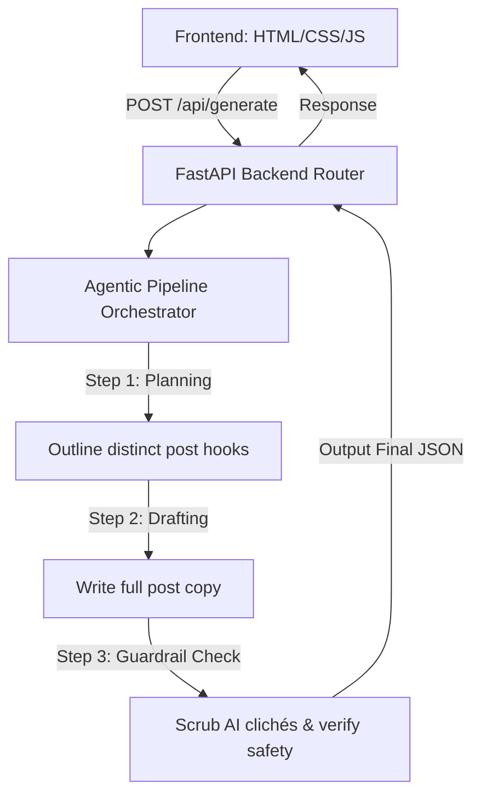

# LinkCraft AI — Agentic LinkedIn Post Generator

LinkCraft AI is a high-fidelity, production-ready web application designed to help creators, founders, and professionals translate core concepts into highly engaging, structured, and customized LinkedIn post variations. 

Unlike single-prompt generators, LinkCraft AI utilizes a multi-stage **agentic pipeline** to plan, draft, and self-correct content, ensuring high readability and platform-native engagement.

---

## 🚀 Product Features & UX Design

- **Goal-Oriented Post Planning**: Generates $\ge$ 3 distinct, highly differentiated content angles (e.g., Storytelling/Anecdotal, Educational Listicle, Bold/Contrarian) rather than simple text repetitions.
- **Customizable Audience & Persona Settings**: Dynamically adapts formatting rules, slang, complexity, and sentence structure based on user-defined personas (e.g., Thought Leader, Relatable Builder) and target reader demographics.
- **Style Mimic Engine**: Allows creators to paste writing examples to emulate sentence structures, spacing, and personal tone.
- **Visual Progress Tracker**: A simulated multi-step loader shows the active state of the agentic pipeline in real time (Planning $\rightarrow$ Drafting $\rightarrow$ Guardrails), enhancing user trust.
- **LinkedIn-Optimized Layouts**: Output cards feature clear spacing, high-traffic hashtag suggestion groups, call-to-actions (CTAs), and a quick copy-to-clipboard function.

---

## 🛠️ Architecture & System Design



### 1. The Multi-Stage Agentic Pipeline
The generation process is executed in an optimized single-pass structure to minimize API latency and request count:
1. **Planning Step**: The agent analyzes the topic and defines structural concepts (hooks, core takeaways) for each post variant.
2. **Drafting Step**: Expands concepts into complete copy, adhering to strict length guidelines and targeted tone guidelines.
3. **Guardrails & Refinement**: A final self-correction stage reviews the draft to remove typical corporate AI buzzwords (e.g., *“delve,” “tapestry,” “in today's fast-paced world”*), format paragraph line-breaks, verify safety standards, and suggest highly relevant hashtags.

### 2. High-Capacity Model Backend
The application is powered by the **Groq API** running **Llama 3.3 70B** (`llama-3.3-70b-versatile`) in structured JSON mode. This ensures extremely fast generation times (typically under 2 seconds) and resolves the tight rate-limit ceilings common with other free-tier AI APIs.

---

## 💻 Tech Stack & Deployment

- **Frontend**: Vanilla HTML5, CSS3 (featuring dark glassmorphic styling, custom keyframe transitions, and responsive grid layouts), and Vanilla JavaScript.
- **Backend**: Python 3.12, FastAPI (high-performance, asynchronous web router), and the Groq Python SDK.
- **Hosting**: Deployed as serverless functions on **Vercel** via API route mapping.

---

## ⚙️ Development & Local Execution

### 1. Prerequisites
- Python 3.12+ installed.
- A Groq API Key from Groq Console.

### 2. Installation
Clone the repository and install the dependencies:
```bash
pip install -r api/requirements.txt
```

### 3. Local Startup
Start the development server using:
```bash
python -m uvicorn api.index:app --reload
```
Open your browser and navigate to `http://localhost:8000` to interact with the application.
